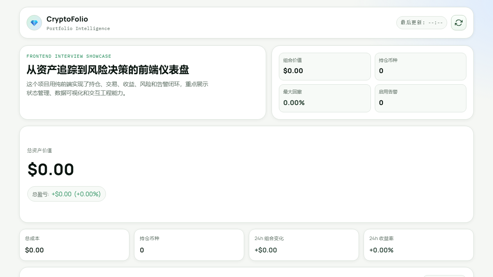
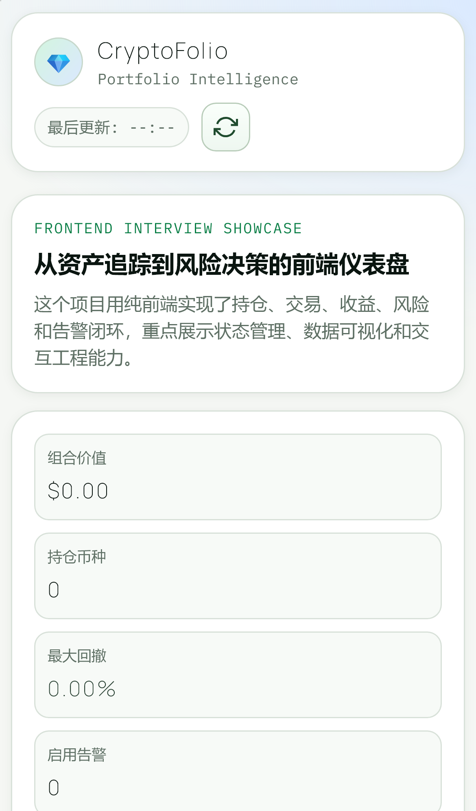

# 🚀 CryptoFolio


CryptoFolio is a **high-performance, zero-framework Web3 portfolio intelligence system**. Designed for professional traders, it goes beyond simple asset tracking to offer institutional-grade risk evaluation, macro market monitoring, and extreme runtime resilience.

👉 **[Live Demo (Vercel)](https://crypto-portfolio-tracker-tan-nine.vercel.app/)** | **[GitHub Pages Mirror](https://qusetions.github.io/cryptofolio-pages/)**

---

## ✨ Why CryptoFolio? (The "Hardcore" Engineering)

Built from the ground up without heavy frameworks like React or Vue, this project is a testament to deep engineering fundamentals:

- **🏗️ Pure Vanilla JS & Dependency Injection (DI)**: Business logic and UI are completely decoupled through a custom Inversion of Control (IoC) architecture (`app-orchestrator.js`). The core domain runs flawlessly in Node.js for headless testing.
- **🧮 Institutional Financial Engine**: Hand-crafted mathematical models for `O(n)` **Max Drawdown**, **95% Value at Risk (VaR95)**, and a highly robust **FIFO** cost basis algorithm that handles `1e-12` floating-point precision anomalies typical in Web3 meme coins.
- **🛡️ Extreme Resilience (User-Focused)**: In volatile crypto markets, API Rate Limits (HTTP 429) are common. CryptoFolio implements a robust `Error Boundary` with a sliding-window `localStorage` failover. **Even if the network disconnects, the dashboard renders seamlessly from cached snapshots without whitespace or crashes.**
- **🧪 Military-Grade QA (Accountability)**: Network failure handling isn't just a theory; it's proven daily in CI via **Playwright**, where end-to-end tests intentionally trigger `context.setOffline(true)` to assert UI fallback behaviors.

---

## 📸 Sneak Peek

### Architecture Concept


### Desktop View


### Mobile Adaptation


---

## 🎯 Core Capabilities

- **Risk Decision Workspace**: Aggregates macro indicators (Fed rates, DXY), news sentiment, and stress-test scenarios into actionable risk posture suggestions.
- **Multi-View Analytics**: Dedicated routes for Assets, Transactions, Risk Attribution, Strategy Rebalancing, and Alerts.
- **Anti-Corruption Layer**: Safe data import/export with rigorous normalization, type validation, and XSS sanitization (`storage.js`).
- **Seamless Internationalization (i18n)**: Deep bilingual support (`en-US` / `zh-CN`) ensuring culturally correct number, date, and currency formatting.

---

## 🛠️ Quick Start

```bash
# 1. Clone the repository
git clone https://github.com/QUSETIONS/crypto-portfolio-tracker.git
cd crypto-portfolio-tracker

# 2. Install dev dependencies (for testing and linting only - the app itself has 0 prod dependencies!)
npm install

# 3. View locally (Just open target HTML file, or use a local dev server)
npx serve .
```

## 🧪 Testing & CI

```bash
# Run unit tests (Vitest)
npm run test:unit

# Run End-to-End tests simulating offline scenarios (Playwright)
npm run test:e2e:smoke

# Run the complete CI pipeline (Lint, Unit, E2E, Lighthouse)
npm run ci:all
```

---

## 📚 Documentation 

- [Architecture & Design (`ARCHITECTURE.md`)](ARCHITECTURE.md)
- [Deployment Guide (`docs/DEPLOY.md`)](docs/DEPLOY.md)
- [Architectural Decision Records (`DECISIONS.md`)](DECISIONS.md)

> **Disclaimer**: This system provides decision-support analytics only and does not constitute financial or investment advice.

---

## 🇨🇳 中文简介

CryptoFolio 是一个摒弃了臃肿框架的**纯 Vanilla JS Web3 资产风险决策系统**。

它不仅仅是一个记账工具，更展现了极致的工程硬核实力：
- 采用 **原生依赖注入 (DI)** 实现 UI 与底层数学逻辑的完全解耦。
- 脱离 DOM 手写 O(n) 最大回撤、95% 在险价值 (VaR95) 以及带 1e-12 容差防截断的 FIFO 队列算法。
- 引入结合滑动窗口日志防爆的全局 Error Boundary，并通过 Playwright 强制断网 (`setOffline`) 验证离线缓存降级能力，确保行情剧烈波动下永不白屏。

[查看线上体验版](https://crypto-portfolio-tracker-tan-nine.vercel.app/)
